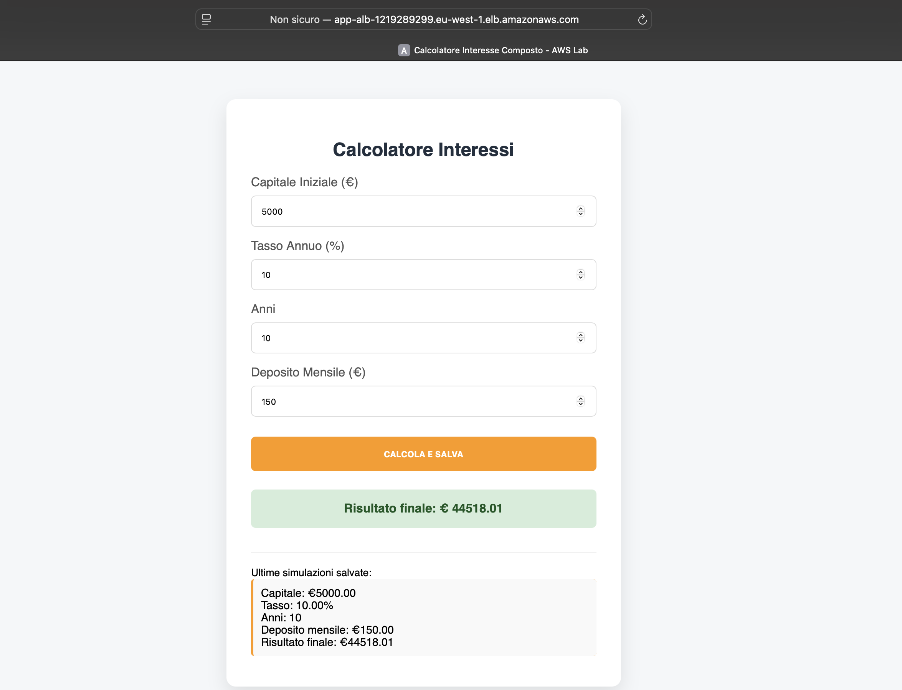

#📈 AWS 3-Tier Web App – Interest Calculator 

- - - - - - -
Progettazione e deploy automatizzato di un'architettura Cloud scalabile e sicura. Il progetto ospita una Web App Python per il calcolo dell'interesse composto (PAC) con dashboard storica dei risultati. 

#🏗️ Architettura di rete (Networking)

- - - - - - -
-L’infrastruttura è divisa su subnet pubbliche e private per garantire l’isolamento delle risorse:
-VPC CUSTOM: Con 4 subnet, 2 pubbliche e 2 private su diverse Availabilty Zone.
-CONNETTIVITA’: Internet gateway Per l’accesso ad internet del Load Balancer e Nat gateway per permettere alle risorse in subnet private di comunicare in uscita in modo sicuro.
-ROUTE TABLE: Due diverse route table, per gestire correttamente il traffico nelle subnet pubbliche e private.

#🔐 Sicurezza e gestione delle Identità 

- - - - - - -
-PRINCIPIO DEL MINIMO PRIVILEGIO: Creati Iam roles specifici per le istanze EC2.
-SECRETS MANAGER: Utilizzo di AWS Systems Manager Parameter Store per la gestione della Password del Database (RDS).
-DATA ENCRYPTION: Implementazione di una chiave KMS per cifrare e decifrare le credenziali lette dalle Istanze.
-SECURITY GROUPS: Regole per gestire il traffico in ingresso e uscita dalle singole risorse per permettere il traffico dall’Alb verso le istanze e dalle Istanze al Database.

#⚙️Calcolo e Automazione

- - - - - - -
-APPLICATION LOAD BALANCER: Punto di accesso unico che distribuisce il traffico sulle istanze nelle subnet private.
-AUTO SCALING GROUP: Gestione automatica della flotta di Istanze Ec2 per garantire la resilienza e alta disponibilità.
-BOOTSTRAP AUTOMATION (USER DATA): Scripting Bash per il provisioning automatico dell’Ambiente nelle Istanze create, Setup.sh per i file app.py e index.html e inizializzazione del Database all’avvio.

#📊Funzionalità dell'App 

- - - - - - -
L'applicazione riceve in input: 

	1	Capitale Iniziale 💰
	2	Interesse annuo stimato (%) 📈
	3	Durata (Anni) ⏳
	4	Deposito mensile ➕ 
Output: Calcolo del capitale finale calcolando l’interesse composto e salvataggio automatico su una dashboard storica accessibile via web. 

📌 Cosa dimostra questo progetto :

	•	✅ Terraform: Gestione di infrastrutture multi-tier complesse.
	•	✅ Sicurezza : Protezione dei dati e isolamento delle reti.
	•	✅ Scalabilita : Configurazione di sistemi Health check e auto-scaling.
	•	✅ Integrazione app:  Integrazione tra codice applicativo (Python) e infrastruttura. 

